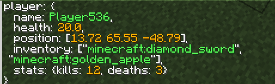

# MCFunction Debug Toolkit

[English](README.md) | **简体中文**

面向 Minecraft Java 命令、函数与数据包开发的 Fabric 调试辅助模组。
在 `.mcfunction` 中加入 `#!` 调试行，即可读取真实执行上下文、记分板和 NBT；
可选的 MCP 桥接还能让 AI 执行命令、读取输出、操作游戏并检查截图。

> 当前为适配 Minecraft Java `26.2` 的开发预览版。

速览：

```mcfunction
#! player: \{
#!   name: {@s},
#!   health: {entity @s Health: .1f},
#!   position: [{position:.2f}],
#!   inventory: [{storage demo:showcase inventory[]: {}, ...}],
#!   stats: \{kills: {@s kills}, deaths: {@s deaths}\}
#! \}
```

聊天栏立即得到：



## 示例

```mcfunction
# 当前执行上下文
#! [{fname}] {@s} 位于 {position:.2f}，朝向 {rotation:.1f}
#! 选中的目标={@e[tag=target]}
#! 维度={dimension} 锚点={anchor} 调用栈={fstack}

# 单个记分板值
#! 自己的分数={@s points}
#! 全局假玩家={#total stats}

# 动态列出选择器命中的所有分数
#! 所有分数={@e[tag=test] points: {"{display_name} [{holder}]={score:04d}"}, ...}

# 获取 Storage 中的单位向量
#! 单位方向={storage demo:debug direction[]: {value:.4f}, ...}

# 获取实体的 UUID 和血量
#! 自己的UUID={entity @s UUID}
#! 自己的血量={entity @s Health}
#! 最近目标={entity @e[tag=target,sort=nearest,limit=1] UUID}
#! 最近目标血量={entity @e[tag=target,sort=nearest,limit=1] Health}

# 方块实体 NBT
#! 箱子物品={block ~ ~ ~ Items[]: {}, ...}

# 每两个值为一组；/no_strip 会保留没有值可填的模板
#! 分组={storage demo:debug values[]: {}, {}, ... /no_strip}

# 花括号没有闭合时，连续的 #! 行自动拼接
# 内层 ... 按坐标重复，外层 ... 按实体重复
#! 玩家坐标={
#! entity @a Pos[]: {{entity}: {}, ...}\n ...
#! }

# 字面花括号和换行
#! 原始数据=\{{storage demo:debug values[]: {}, ...}\}\n锚点={anchor}
```

运行函数时，结果会作为原生 Minecraft 文本组件发送给所有玩家。错误的 `#!` 会在
reload 时警告并跳过，不影响函数其他命令；运行时错误会显示简短信息并保留完整诊断。

不连接 MCP 时，它就是一个面向人的调试模组。连接 MCP 后，AI 还可以验证和执行命令、
增量读取聊天与调试事件、控制移动和 GUI，并获取 JPEG 截图。

```text
运行 demo:setup，读取新增的 #! 输出；如果没有错误，向前走半秒并右键，
然后截图说明游戏里发生了什么。
```

## 文档

- [更新日志（英文）](CHANGELOG.md)
- [安装模组并连接 AI Agent](docs/AI_AGENT_SETUP.md)
- [`#!` 完整语法与格式指南](docs/DEBUG_DIRECTIVES.md)
- [MCP 与 HTTP 协议](docs/PROTOCOL.md)
- [架构说明](docs/ARCHITECTURE.md)
- [真实数据包测试](docs/REAL_WORLD_SYNTAX_TEST.md)

## 安全提示

- 自动化测试优先使用临时存档，并保留备份。
- 桥接端口只应监听 `127.0.0.1`。
- bearer token 等同于高权限命令访问凭据。
- `allow_dangerous` 只是防误操作护栏，不是安全沙箱。
- 不要自动重试 `timeout_unknown_outcome`，命令可能已经执行。

## 许可证

[MIT](LICENSE)
